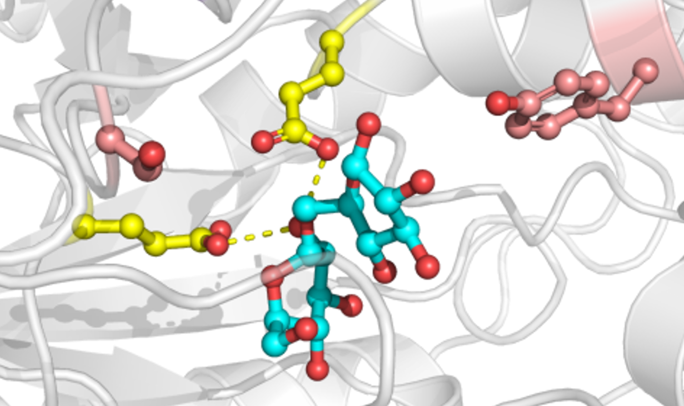

# A2CA – Amino Acid Cluster Analysis



**A2CA** is a web application for examining amino-acid variation in a phylogenetic and structural context. It combines multiple-sequence alignments, phylogenetic trees, physicochemical amino-acid properties, optional protein structures, and pairwise coevolution analyses in one interactive workflow.

This repository contains the **hosted web edition of A2CA 2.0.44**, prepared for deployment on Railway.

## Features

- Start from a **single protein sequence or structure**, retrieve homologs with NCBI BLAST, then continue through alignment and tree inference.
- Start from **unaligned FASTA sequences** and generate an alignment with MAFFT and a phylogeny with FastTree.
- Start from a **prepared alignment and Newick tree**.
- Select a reference sequence and map amino-acid positions across the alignment.
- Visualize conservation and amino-acid properties on a phylogenetic tree.
- Upload or fetch PDB structures and interactively map selected residues in 3D.
- Explore pairwise residue coevolution with similarity-aware and phylogeny-adjusted views.
- Save and restore portable `.a2ca` analysis sessions.
- Export figures, trees, alignments, sequences, and raw tables.

## Architecture

The hosted edition has two layers:

1. **Browser application** – HTML/CSS/JavaScript under `resources/`. Most analysis, plotting, session handling, and structure interaction happen in the browser. Dedicated JavaScript modules separate reusable services and scientific calculations from page/UI code.
2. **Small Python web server** – `main.py`. It serves A2CA, provides narrowly scoped same-origin proxy endpoints for NCBI BLAST/Protein EFetch and RCSB PDB retrieval, and executes MAFFT and FastTree locally in the hosted container. It also exposes metadata/status endpoints for deployment diagnostics.

The Python backend uses only the standard library. No user data are intentionally persisted by the server.

## Deploy on Railway

Railway uses the repository-level [`railway.toml`](railway.toml) together with [`railpack.json`](railpack.json). Railpack installs the MAFFT and FastTree runtime packages, and Railway starts A2CA with:

```text
python main.py
```

`main.py` reads Railway's `PORT` environment variable and listens on `0.0.0.0`. A `/health` endpoint is included for Railway deployment health checks.

### GitHub → Railway

1. Push this repository to GitHub.
2. In Railway choose **Deploy from GitHub repo** and select the A2CA repository.
3. Leave the repository root as the service root.
4. Railway will read `railway.toml`; no custom build command is required.
5. After the deployment is healthy, open **Settings → Networking → Generate Domain**.
6. Visit the generated `*.up.railway.app` URL. `/` redirects to the A2CA start page.

Railway documentation:
- <https://docs.railway.com/quick-start>
- <https://docs.railway.com/config-as-code>
- <https://docs.railway.com/networking/public-networking>

## Local development of the web edition

Python 3.12 is recommended for development. No Python packages are required. MAFFT and FastTree must be installed and available on `PATH` for the FASTA workflow.

```bash
python main.py
```

Then open:

```text
http://127.0.0.1:8000/
```

The public website is the intended distribution target for this repository. Desktop/offline A2CA builds are maintained separately.

## Repository structure

```text
A2CA/
├── main.py                  # Hosted web server and scientific-service proxy
├── railway.toml             # Railway service/health configuration
├── railpack.json            # Runtime packages and start command
├── .python-version
├── README.md
├── VERSION
├── CITATION.cff
├── LICENSE                    # PolyForm Noncommercial 1.0.0
├── SECURITY.md
├── CONTRIBUTING.md
├── CHANGELOG.md
├── requirements.txt         # Documents the zero-dependency Python backend
├── package.json             # JavaScript lint configuration/development tooling
├── resources/
│   ├── upload.html
│   ├── upload_single.html
│   ├── upload_fasta.html
│   ├── upload_precomputed.html
│   ├── reference.html
│   ├── analysis.html
│   ├── alignment.html
│   ├── sequences.html
│   ├── tree.html
│   ├── parameters.html
│   ├── a2ca-core.js
│   ├── a2ca-services.js
│   ├── a2ca-analysis-science.js
│   ├── *.js
│   ├── styles.css
│   └── assets/
├── tests/
│   ├── analysis_science.test.mjs
│   └── browser_smoke.mjs
├── tools/
│   └── validate_repo.py
└── .github/
    └── workflows/
        └── validate.yml
```

## External software and services

A2CA uses or communicates with:

- **NCBI BLAST Common URL API** and **NCBI Protein EFetch** for homolog discovery and protein-sequence retrieval.
- **MAFFT** executed directly in the A2CA server container (`mafft --auto --amino --anysymbol`) for multiple-sequence alignment.
- **FastTree** executed directly in the A2CA server container for phylogenetic inference. The detected runtime version is exposed by `/api/meta` and stored with generated pipeline metadata.
- **RCSB Protein Data Bank** for structure retrieval by PDB identifier.
- **3Dmol.js 2.5.5** for interactive WebGL structure visualization.

External services are subject to their own availability, terms, and usage limits.

## Data and privacy

A2CA does not intentionally persist uploaded sequences, structures, alignments, trees, or `.a2ca` session files. Most analysis state is handled locally in the user's browser and can be exported explicitly by the user.

In the single-sequence BLAST workflow, only the selected protein query sequence is forwarded to NCBI BLAST; an uploaded structure file itself is not sent to NCBI. Identifiers entered for NCBI Protein or RCSB PDB retrieval are sent to the corresponding external service. Unaligned FASTA submitted through the FASTA workflow is sent to the A2CA Railway service so MAFFT and FastTree can run server-side, but those sequences are not forwarded to a third-party alignment or tree service.

The public proxy and compute endpoints are parameter-restricted, same-origin protected, size limited, and rate limited. NCBI BLAST requests are additionally serialized conservatively so the hosted service does not contact the remote BLAST endpoint too frequently.

## Validation

Run the repository checks with:

```bash
python tools/validate_repo.py
```

GitHub Actions performs static checks, ESLint undefined-variable checks, unit tests for the extracted scientific JavaScript module, live MAFFT/FastTree endpoint smoke tests, and a Chromium FASTA-workflow smoke test on pushes and pull requests.

## Citation

The original R/Shiny implementation of A2CA is archived as:

> D. Eggerichs, D. Tischler; Science Data Bank (2023). DOI: [10.57760/sciencedb.09549](https://doi.org/10.57760/sciencedb.09549)

A machine-readable citation is provided in [`CITATION.cff`](CITATION.cff).

## Versioning

The application version is stored in [`VERSION`](VERSION). Git tags for releases should use the form `v2.0.44`.

## License and reuse

Copyright © 2026 Daniel Eggerichs. Copyright and ownership of A2CA remain with Daniel Eggerichs.

A2CA is licensed under the [PolyForm Noncommercial License 1.0.0](LICENSE) (SPDX: `PolyForm-Noncommercial-1.0.0`). The license permits use, modification, and redistribution for noncommercial purposes, including research and use by educational and public research organizations. Commercial use is not licensed and requires separate permission from the copyright holder.

This is a source-available noncommercial software license rather than an OSI-approved open-source license.

## Security

See [`SECURITY.md`](SECURITY.md). Do not publish sensitive sequence data, credentials, or private `.a2ca` session files in GitHub issues.
